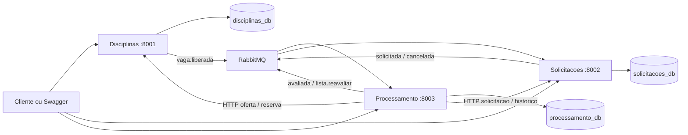

# Sistema de matricula em disciplinas

Infraestrutura e demonstracao integrada da **etapa 2** de Projeto de Software.
A aplicacao usa tres servicos Python/FastAPI com PostgreSQL, comunicacao HTTP e RabbitMQ.

| Repositorio | Responsabilidade | Porta | Banco |
|---|---|---:|---|
| [matricula-disciplinas](https://github.com/nadertaha06/matricula-disciplinas) | Oferta, horarios e reservas de vagas | 8001 | disciplinas_db |
| [matricula-solicitacoes](https://github.com/nadertaha06/matricula-solicitacoes) | Solicitacoes, historico e estados | 8002 | solicitacoes_db |
| [matricula-processamento](https://github.com/nadertaha06/matricula-processamento) | Regras e lista de espera | 8003 | processamento_db |

## Arquitetura implementada



Os bancos sao logicamente separados numa unica instancia PostgreSQL. Nenhum servico le tabelas de outro banco.
Na EC2, cada servico possui usuario proprio de banco e configuracao privada.

## Executar localmente

Clone os quatro repositorios como diretorios irmaos:

```sh
git clone https://github.com/nadertaha06/matricula-infra.git
git clone https://github.com/nadertaha06/matricula-disciplinas.git
git clone https://github.com/nadertaha06/matricula-solicitacoes.git
git clone https://github.com/nadertaha06/matricula-processamento.git
cd matricula-infra
cp .env.example .env
# Edite .env com senhas locais; nao versione esse arquivo.
python3 scripts/configure.py
docker network inspect rede >/dev/null 2>&1 || docker network create rede
docker compose up -d --build --wait
python3 scripts/smoke_e2e.py
```

Requisitos: Python 3.12 para os servicos, Python 3 para os scripts de demonstracao, Docker e Compose v2 com `--wait`.
O teste E2E retorna `resultado: PASS` somente apos observar os resultados assincronos esperados.
Cada execucao cria registros sinteticos com identificador unico; nao apaga registros anteriores.

## Demonstracao da entrega

Acesse `/docs` nas portas 8001, 8002 e 8003. Para testar a implantacao publicada:

```sh
python3 scripts/smoke_e2e.py --host 13.220.42.157
```

O roteiro exercita:

1. Prontidao dos tres bancos e servicos.
2. Cadastro de disciplinas, turma com uma vaga e historicos ficticios.
3. Deferimento assincrono e repeticao idempotente da solicitacao.
4. Lista de espera ordenada por coeficiente.
5. Indeferimento por pre-requisito e choque de horario.
6. Cancelamento, liberacao de vaga e promocao automatica em duas rodadas.
7. Conferencia da capacidade e da trilha de estados.

Para conferir o resultado manualmente, use os IDs retornados pelo script em `GET /matriculas/{id}`, `GET /avaliacoes/{id}` e `GET /turmas/{id}`.
O RabbitMQ fica na rede Docker; o painel administrativo local e acessado por tunel SSH, sem necessidade de expor AMQP na internet:

```sh
ssh -i /caminho/da/chave.pem -L 15672:localhost:15672 ubuntu@13.220.42.157
```

## Testes reais e relatorios

Suba as dependencias **exclusivas de testes** (as portas 5432 e 5672 locais devem estar livres):

```sh
docker compose -f compose.test.yml up -d --wait
```

Em um ambiente Python 3.12 ativado, instale `requirements-dev.txt` dos servicos e execute:

```sh
bash scripts/test-all.sh
```

Os testes usam bancos terminados em `_test` e o vhost `etapa2-tests`. Testes unitarios isolam regras; testes de integracao usam PostgreSQL e RabbitMQ reais. Os testes do cliente HTTP isolam erros de protocolo; `smoke_e2e.py` verifica a comunicacao real entre todas as APIs.

Cada repositorio aplica minimo de **80% de cobertura de linhas e branches** via pytest-cov/coverage.py. O GitHub Actions publica o percentual medido no resumo e disponibiliza HTML, XML, JSON e JUnit como artefatos. Relatorios gerados nao ficam no Git.

- [CI disciplinas](https://github.com/nadertaha06/matricula-disciplinas/actions)
- [CI solicitacoes](https://github.com/nadertaha06/matricula-solicitacoes/actions)
- [CI processamento](https://github.com/nadertaha06/matricula-processamento/actions)

Abra o artefato da execucao desejada e, apos extrair, abra `coverage/index.html`. O relatorio permite navegar por arquivo e ver linhas e branches nao exercitados.

## Deploy automatico

Os tres repositorios possuem pipelines independentes: testes -> imagem DockerHub com tag SHA -> SSH -> readiness -> rollback em caso de falha.
A EC2 usa a rede `rede`, PostgreSQL e RabbitMQ compartilhados pela aplicacao. O deploy dos servicos nao recria os bancos nem os volumes.

Secrets dos repositorios de servico: `DOCKERHUB_TOKEN`, `HOST_TEST` e `KEY_TEST`.
Variavel: `EC2_HOST_KEY`, contendo a chave publica SSH esperada.
Arquivos privados na EC2: `~/.config/matricula/matricula-{servico}.env`, modo 600. Podem ser preparados a partir de `runtime/*.env`, ajustando usuarios de banco e credenciais do ambiente.

`DB_PASSWORD`, `RABBITMQ_URL` e campos Auth0 anteriormente criados no GitHub nao sao interpolados no shell de deploy. A configuracao efetiva vem dos arquivos privados da EC2.
A imagem implantada e a do SHA aprovado nos testes, mesmo que outro push atualize `latest`.
Um lock no servidor serializa as atualizacoes para reduzir o uso simultaneo de disco e memoria.

O compose completo e voltado ao primeiro provisionamento/local. Em uma EC2 existente, preserve o volume do PostgreSQL e o volume/nodename do RabbitMQ antes de alterar sua composicao. **Nao execute `down -v` para atualizar a aplicacao.**

## Confiabilidade

Outbox registra eventos na mesma transacao do negocio. Publicacao confirmada, mensagens persistentes, filas duraveis, inbox por evento e resultados com revisao permitem repeticao segura. Falhas de consumo usam retentativa temporizada; a terceira falha envia a mensagem para `matriculas.dlq`.

A DLQ exige inspecao e republicacao apos a causa ser corrigida. Uma chamada entre servicos nao participa de uma transacao distribuida: o endpoint de reserva e idempotente por solicitacao para permitir repeticao apos falha. O teste de promotora garante que a falha de um candidato posterior nao desfaz uma promocao ja feita.

O criterio configurado ordena a **lista de espera**, sem redistribuir vagas ja deferidas. Cada promocao e uma transacao separada; `lista.reavaliar` agenda a continuacao. Posicoes sao calculadas no momento da consulta.

## Revisao da etapa 1 e escopo seguinte

A etapa 1 definiu corretamente tres servicos e permitiu usar Python (o enunciado aceita Python ou Java). A estrutura e o deploy existiam, mas os testes cobriam apenas identificacao e health, sem validar persistencia ou matricula.

A etapa 2 implementa essas responsabilidades e corrige as seguintes divergencias:

- O servico chamado `servico-matriculas` no documento corresponde ao repositorio `matricula-solicitacoes`; seu banco efetivo e `solicitacoes_db`.
- `matricula-infra` e o quarto repositorio, de infraestrutura; nao conta como um quarto servico de negocio.
- Configuracao da API e conexao do worker tem ciclo de vida por processo; Singleton nao significa uma instancia global entre containers.
- O processamento e continuo por eventos. A politica por turma esta em `lote`; nao ha redistribuicao global de vagas por lote fechado.
- A lista de espera e a selecao de avaliacoes com estado `EM_ESPERA`, evitando uma segunda tabela com estado duplicado. Historico academico e horarios usam colunas JSON nos respectivos bancos.
- `posicao_espera` foi substituida por consulta da posicao atual em `/lista-espera`; `revisao` protege a ordem dos resultados.
- `matricula.cancelada` e `lista.reavaliar` completam o protocolo de eventos.

**Etapa 3:** Auth0, autorizacao, identidade derivada do JWT, tokens M2M e frontend. As APIs atuais sao de demonstracao, com identidade explicita e sem controle de acesso implementado.

**Etapa 4:** API Gateway, testes de carga, Prometheus e Grafana. Cobertura de testes e monitoramento de producao sao atividades diferentes.
